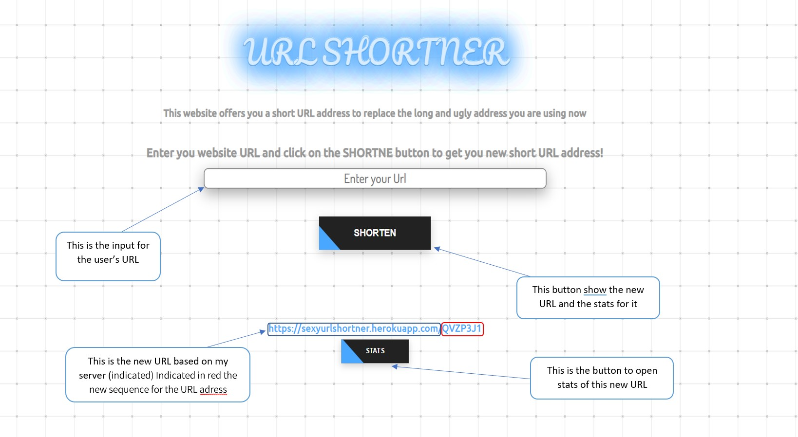

# 

This is the link to my website:
https://sexyurlshortner.herokuapp.com/

This is the link to my project in replit:
https://replit.com/@YamEbgui/url-shortener#
## Introduction
My website is made up of Backend and Frontend.
In this project, I built my own [URL shortner](https://en.wikipedia.org/wiki/URL_shortening)!
To create this website I used:

- Html
- JavaScript
- Scss
- Webpack 5
- Heroku

To build my server I used the Express.js framework.

# BackEnd
## How it Built
The server is made up of routers , dataBase class, and error handler. 
Class dataBase is used here to build an object of URL and rewrite the dataBase file. 
Also, it is used to get the stats of each new URL address the dataBase has.
The routers get the request from the user and make his request using the dataBase class. 
If the routers cannot fulfill the user request the request move forward to error handler.

## Structure of the DataBase

The URL addresses the user inserted into the website are storage in DataBase.
the structure of this DataBase is:

{"objects" : [
{ originUrl: ,
shortUrl:,
views:,
creatorDate: }
]}

# FrontEnd
# 

This project was built in collaboration with Ziv Serphos and Nadav Vol.
